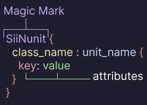

<h3 align="center">

  

 SCS Intellisense extension for <a href="https://code.visualstudio.com">VSCode</a>

</h3>

## About

**SCS Intellisense** is a Visual Studio Code Extension that provides some intellisense for the SCS Software files. This extension improves code readability by applying colorization rules to keywords, strings, comments, and other language elements.  

- **SiiNunit** - The **magic marker** that indentifies a plain-text `.sii` file. It appears at the top of the file and marks the file as a serialized unit file.
- **class_name** - The **unit type of class** being defined; it indicates the schema or category of the unit (for example `prefab_model`, `model_def`). It appears before the colon in the unit header.
- **unit_name** - The **unique name** of the unit: a sequence of tokens separated by dots (e.g., `mod.namespace.item`). Use unique names per mod to avoid collisions. Anonymous units may use a leading dot.
- **attribute (key)** - The **property name** inside a unit block; attributes are the keys that hold data for the unit. Each attribute has an associated value and type.
- **value** - The **attribute value**. Value can be **strings**, **numbers**, **booleans**, **unit references**, **vectors (tuples)**, or other engine-specific formats. Use quotes for strings and parentheses for vectors.

## Features

- Syntax highlighting for SCS Software files (`.sii`, `.sui`)
- Support for single-line comments (`// comment`, `# comment`) and multi-line comments (`/* comment */`)
- **Auto-close brackets** - automatically insert matching pairs for braces `{}`, parentheses `()`, and square brackets `[]` to speed up editing and reduce syntax errors

## Tested themes
1. **Dark**
  - `Catppuccin Frappé`
  - `Catppuccin Macchiato`
  - `Catppuccin Mocha` (developed theme)
  - `Dark 2026` (VSCode default modern)
  - `Dracula Theme` & `Dracula Theme Soft`
  - `Abyss`
  - `Dark Modern`
  - `Dark+`

2. **Light**
  - `Catppuccin Latte`
  - Should work with the light variants of the themes listed above.

*Note*: <u>`Dark (Visual Studio)`</u> and <u>`Light (Visual Studio)`</u> do not provide highlighting in all contexts.

## License

Licensed under the [MIT](./LICENSE.md)

**Enjoy**
