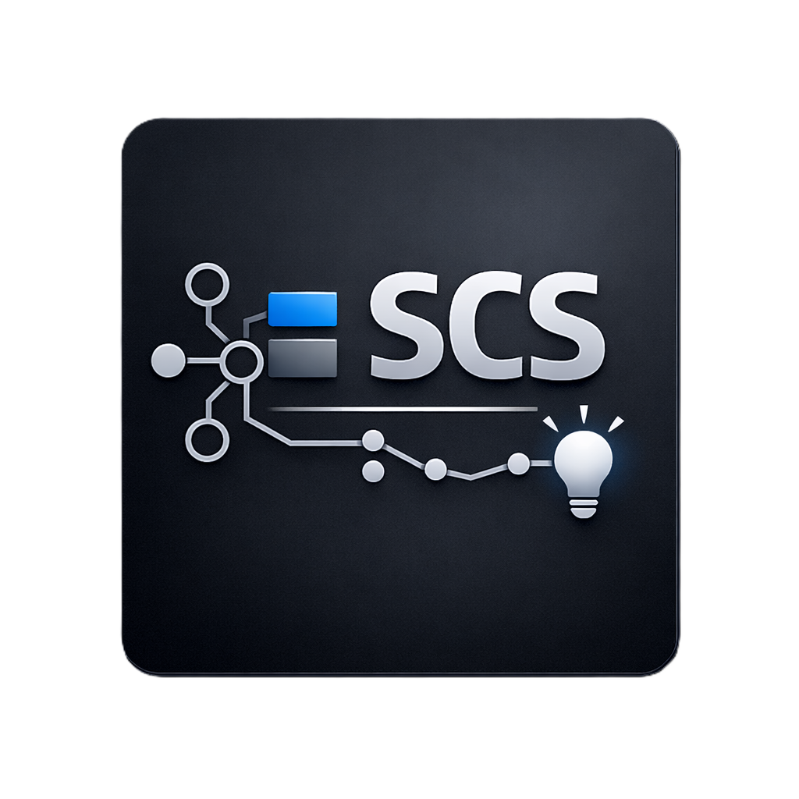

    
  <h3> SCS Intellisense extension for </h3>

  
  

## About

**SCS Intellisense** provides semantic highlighting <!-- and completions --> for <a href="https://www.scssoft.com/" target="_blank" rel="noopener noreferrer">SCS Software</a> data files (`.sii`, `.sui`). It improves readability and speeds up editing by offering:  
- Semantic token coloring for MagicMark, Classes, Attributes (Key and Values), strings, numbers, booleans and comments;
- Auto-Close brackets;
<!-- - Context-aware completions for class attributes and values;
- Snippets for common constructs and directives; -->

### Sii Extructure
> The structure is built as originally described in the <a href="https://modding.scssoft.com/wiki/Documentation/Engine/Units#Unit_definition_entry" target="_blank" rel="noopener noreferrer">documentation</a>.

- **SiiNunit** - The **magic marker** that identifies a plain-text `.sii` file. It appears at the top of the file and marks the file as a serialized unit file.
- **class_name** - The **unit type of class** being defined; it indicates the schema or category of the unit (for example `prefab_model`, `model_def`). It appears before the colon in the unit header.
- **unit.name** - The **unique name** of the unit: a sequence of tokens separated by dots (e.g., `mod.namespace.item`). Use unique names per mod to avoid collisions. Anonymous units may use a leading dot.
- **attribute** - The **property name** inside a unit block; an attribute is a **key + value** pair that holds the unit data.
- **key** - The **attribute name** that identifies the property (e.g. `name` in `name: "Truck"`).
- **value** - The **attribute value**. Value can be **strings**, **numbers**, **booleans**, **unit references**, **vectors (tuples)**, or other engine-specific formats. Use quotes for strings and parentheses for vectors.

## Features

- **Semantic highlighting** for `.sii` and `.sui` files
<!-- - **Completions** for class names, attributes and values (context-aware) -->
<!-- - **`@include` directive**: recognized as a special key (no `:`) -->
- **Comment support**: `//`, `#` and `/* ... */`
- **Icon** for each files `.sii` and `.sui`
- **Auto-close brackets** for `{}`, `()`, `[]`

## Tested themes
1. **Dark**
  - `Dark 2026` (VSCode)
  - `Catppuccin Frappé`
  - `Catppuccin Macchiato`
  - `Catppuccin Mocha` (developed theme)
  - `Dracula Theme` & `Dracula Theme Soft`
  - `Abyss`
  - `Dark Modern`
  - `Dark+`

2. **Light**
  - `Catppuccin Latte`
  - Should work with the light variants of the themes listed above.

*Note*: <u>`Dark (Visual Studio)`</u> and <u>`Light (Visual Studio)`</u> do not provide highlighting in all scopes.

## License

Licensed under the [MIT](./LICENSE.md)

**Enjoy**
